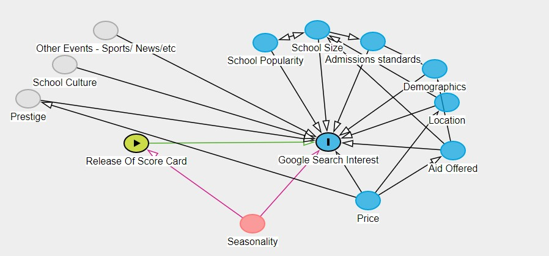

```{r setup, include=FALSE}
knitr::opts_chunk$set(echo = TRUE)
```

```{r, ech0 = FALSE, results= "hide", message=FALSE, warning=FALSE}
# Load initial packages
# install.packages("rlist")
library(tidyverse)
library(ggplot2)
library(dplyr)
library(vtable)
library(fixest)
library(Hmisc)
# library(timetk)
# library(DMwR)
library(tidyr)
library(rlist)
library(lubridate)
library(summarytools)
```
###  Restated Question:

The College Scorecard was released at the start of September 2015. Among colleges that predominantly grant bachelor’s degrees, did the release of the Scorecard shift student interest to high-earnings colleges relative to low-earnings ones (as proxied by Google searches for keywords associated with those colleges)?

#### _Load Data Transfromation Files_
```{r, results= "hide", message=FALSE, warning=FALSE}
google_trends_master <-  read.csv("Generated_data/google_trends_master.csv", na.strings = c("","NA","NULL",NULL))
school_master <- read.csv("Generated_data/school_master.csv", na.strings = c("","NA","NULL",NULL))

```

```{r, echo = FALSE ,results= "hide", message=FALSE, warning=FALSE}
google_trends_master <- google_trends_master %>% 
  mutate(start_of_week = as.Date(start_of_week, format="%Y-%m-%d")) %>% 
  mutate(start_of_month = as.Date(start_of_month, format="%Y-%m-%d")) %>% 
  mutate(month_num = month(start_of_month))
  
```

#### _Join the final data for analysis_
This will create our mastered dataset
```{r}
# Make the final data set and provide reasoning
df <- google_trends_master %>% 
  inner_join(school_master, by = c("opeid", "unitid"))

df <- df %>% 
  rename(schname = schname.x) %>% 
  select(-c("schname.y", "unitid", "opeid", "opeid6", "INSTNM", "INSTURL", 
            "NPCURL"))
  

```

#### _Dagity_

The diagram below represents some of the high level variable interactions that pertain to our research question. 
Notice that we have a lot of factors that play into the "Google search terms" but not many that directly impact "score card". 

We also have a lot of unmeasurable high level variables that are related to search volumes, such as current events, news coverage, prestige or brand awareness, & culture. 

All of these variables can play into the Google Search traffic but they dont impact the score card release date.  

The only thing need's to control for in this case is time & seasonality as anything that changes over time is a potential source of endogeneity for a time related event.  

*** Note:
The Scorecard policy is implemented at a particular time, and looking at how the Scorecard shifted interest really means looking at whether interest shifted at that particular time. This means that anything that changes over time is a potential source of endogeneity, even if it isn't inherently related to the Scorecard




# Variable Selection
There are a lot of variables in this data set available for use, however many of which do not have an intuitive or direct connection to search volumes or score card. Before I go into EDA and modeling I want to reduce our data to a more concise and targeted variable set. 

#### _Removal of PCIP Variables_
The PCIC or "Percentage of degrees awarded in a {specific field}" variables are  high column count but low in explanatory value, at least for our research question.  Intuitively i cant reason how or why the % of degrees awarded for a particular field would be at all related to Google search traffic for a university, nor would it impact the score card being released or when.  

Just for good measure im going to run a very simply linear model to see if there is any variable worth looking into more. 
From the results (below) i conclude that these variables do not have individual or cumulative explanatory power over our depended variable (search volume).

There for im removing them from the analysis. 
```{r}
# paste(colnames(df), collapse = " + ")

m1 <- feols(md_wk_std_idx ~ PCIP03 + PCIP04 + PCIP05 + PCIP09 + PCIP10 + PCIP11 + PCIP12 + PCIP13 + PCIP14 + PCIP15 + PCIP16 + PCIP19 + PCIP22 + PCIP23 + PCIP24 + PCIP25 + PCIP26 + PCIP27 + PCIP29 + PCIP30 + PCIP31 + PCIP38 + PCIP39 + PCIP40 + PCIP41 + PCIP42 + PCIP43 + PCIP44 + PCIP45 + PCIP46 + PCIP47 + PCIP48 + PCIP49 + PCIP50 + PCIP51 + PCIP52 ,data = df)
etable(m1)
```


```{r, echo = FALSE}

# paste(dQuote(colnames(df)), collapse = ", ")

#removing variables with alot of na to cut down analysis
df <- df %>% 
  select(-c("PCIP01", "PCIP03", "PCIP04", "PCIP05", "PCIP09", "PCIP10", "PCIP11", "PCIP12", "PCIP13", "PCIP14", "PCIP15", "PCIP16", "PCIP19", "PCIP22", "PCIP23", "PCIP24", "PCIP25", "PCIP26", "PCIP27", "PCIP29", "PCIP30", "PCIP31", "PCIP38", "PCIP39", "PCIP40", "PCIP41", "PCIP42", "PCIP43", "PCIP44", "PCIP45", "PCIP46", "PCIP47", "PCIP48", "PCIP49", "PCIP50", "PCIP51", "PCIP52", "PCIP54")) 

```

#### _Removal of Demographic Variables_
Additional I want to remove Race/ Ethnicity flags from our data set.While interesting for another study this data dose not pertain to our research question at hand, nor do I intuitively see any connection with school demographics and Google search volumes.
```{r}
# paste(colnames(df), collapse = " + ")
m3 <- feols(md_wk_std_idx ~ UGDS_WHITE + UGDS_BLACK + UGDS_HISP + UGDS_ASIAN + UGDS_AIAN + UGDS_NHPI + UGDS_2MOR + UGDS_NRA + UGDS_UNKN + HBCU + PBI + ANNHI + TRIBAL + AANAPII + HSI + NANTI + MENONLY + WOMENONLY,data = df)
etable(m3)
```
```{r, echo = FALSE}
# paste(dQuote(colnames(df)), collapse = ", ")

#removing variables with alot of na to cut down analysis
df <- df %>% 
  select(-c("UGDS_WHITE", "UGDS_BLACK", "UGDS_HISP", "UGDS_ASIAN", "UGDS_AIAN", "UGDS_NHPI", "UGDS_2MOR", "UGDS_NRA", "UGDS_UNKN", 
            "HBCU", "PBI", "ANNHI", "TRIBAL", "AANAPII", "HSI", "NANTI", "MENONLY", "WOMENONLY")) 
```

#### _Remove High % NULL Columns_
Next i want to remove any variables that have a high amount of nulls records. While our time series trends data contains many observations for school features contain less than 2k observations. Introducing measures that have a high proportion of NULL records can introduce analytical debts.

My Null removal criteria is rather arbitrary, however im selecting a cut off at 25% null, meaning that im rejecting any variables that have more than 25% of schools failing to report on them. 

```{r, echo=FALSE}
x <- map(df, ~mean(is.na(.))) 
y <- data.frame(t(sapply(x,c)))
ty <- as.data.frame(t(y))
ty <- ty %>% 
  filter(V1 >.25)
y = as.data.frame(t(ty))
# paste(dQuote(colnames(y)), collapse = ", ")

```

Just for good measure im going to run a very simply linear model to see if there is any variables worth looking into more. 
From the results (below) i conclude that these variables do not have individual or cumulative explanatory power over our depended variable (search volume).

Most of these variables are related to (SAT, ACT scores & Avg net price for families) which i don't find particularly helpful for this analysis either. 

There for I am removing them from the analysis.
```{r}

# temp df to convert Na to 0
df_m <- df %>%
  mutate_at(c(8:66), ~replace_na(.,0))

m2 <- feols(md_wk_std_idx ~ RELAFFIL + SATVR25 + SATVR75 + SATMT25 + SATMT75 + SATWR25 + SATWR75 + SATVRMID + SATMTMID + SATWRMID + ACTCM25 + ACTCM75 + ACTEN25 + ACTEN75 + ACTMT25 + ACTMT75 + ACTWR25 + ACTWR75 + ACTCMMID + ACTENMID + ACTMTMID + ACTWRMID + SAT_AVG + NPT4_PUB.AVERAGE.ANNUAL.COST + NPT4_PRIV + NPT41_PUB + NPT42_PUB + NPT43_PUB + NPT44_PUB + NPT45_PUB + NPT41_PRIV + NPT42_PRIV + NPT43_PRIV + NPT44_PRIV + NPT45_PRIV + RET_FTL4 + RET_PT4 + RET_PTL4 + C200_L4_POOLED_SUPP ,data = df_m)
etable(m2)
```
```{r, echo = FALSE}
#removing variables with alot of na to cut down analysis
df <- df %>% 
  select(-c("RELAFFIL", "SATVR25", "SATVR75", "SATMT25", "SATMT75", "SATWR25", "SATWR75", "SATVRMID", "SATMTMID", "SATWRMID", "ACTCM25", "ACTCM75", "ACTEN25", "ACTEN75", "ACTMT25", "ACTMT75", "ACTWR25", "ACTWR75", "ACTCMMID", "ACTENMID", "ACTMTMID", "ACTWRMID", "SAT_AVG", "NPT4_PUB.AVERAGE.ANNUAL.COST", "NPT4_PRIV", "NPT41_PUB", "NPT42_PUB", "NPT43_PUB", "NPT44_PUB", "NPT45_PUB", "NPT41_PRIV", "NPT42_PRIV", "NPT43_PRIV", "NPT44_PRIV", "NPT45_PRIV", "RET_FTL4", "RET_PT4", "RET_PTL4", "C200_L4_POOLED_SUPP")) 

```


#### _Variables of Interest_
After bulk variable removal we are left with the following variables for analysis, this s now a much more tailored data set. 

|Variable|Description|
|:----|:----|
|start_of_week|the start of the week for the index value refers to|
|after_score_card|Is week after the score card date 2015-09-01. T/F|
|md_wk_std_idx|Normalized Index by school term|
|schname|school name|
|CITY|City|
|STABBR|State postcode|
|HCM2|Schools that are on Heightened Cash Monitoring 2 by the Department of Education|
|PREDDEG|Predominant degree|
|CONTROL|Control of institution|
|LOCALE|Locale of institution|
|DISTANCEONLY|Flag for distance-education-only education|
|PPTUG_EF|Share of undergraduate, degree-/certificate-seeking students who are part-time|
|CURROPER|Flag for currently operating institution, 0=closed, 1=operating|
|PCTPELL|Percentage of undergraduates who receive a Pell Grant|
|RET_FT4|First-time, full-time student retention rate at four-year institutions|
|PCTFLOAN|Percent of all federal undergraduate students receiving a federal student loan|
|UG25abv|Percentage of undergraduates aged 25 and above|
|GRAD_DEBT_MDN_SUPP|Median debt of completers, suppressed for n=30|
|GRAD_DEBT_MDN10YR_SUPP|Median debt of completers expressed in 10-year monthly payments, suppressed for n=30|
|RPY_3YR_RT_SUPP|3-year repayment rate, suppressed for n=30|
|C150_4_POOLED_SUPP.REPORTED.GRAD.RATE|#N/A|
|md_reported_ern_10yr|Median earnings of students working and not enrolled 10 years after entry|
|gt_25k_p6|Share of students earning over $25,000/year (threshold earnings) 6 years after entry|


# Feature Creation

#### _Create Feature - log of earnings_
Our research questions states that we want to look at the difference between “high-earning” vs “low-earning” colleges, so how can we define “high” vs “low”? Lets first look at the distribution of earnings among colleges.

This graph represents the density of "median earnings of graduates ten years after graduation for each college".
Density in this case is the `count` of colleges that fall in that earning spectrum.

***
Note a high concentration at ~ 55K threshold. 
Data is self reported and theorize that 55K is often whats input for any salary range between 50K - 60K. 

We can see that this data is skewed to the right, indicating that while most schools "median earning 10 years after graduation" tends to fall right around $40,000 we have some outline schools who report very high earnings above 150K.
```{r}
ggplot(df, aes(x= md_reported_ern_10yr)) + geom_density()

```

To adjust for the skew and normalizes earning data im going to take the log of earnings. 
From this graph we can see that data more closely represents a normal curve when represented as a log().
This indicate that if we are to use the earnings in this analysis (Which we are) we should probably explore its representation inits log() form.
```{r}
ggplot(df, aes(x= log(as.numeric(md_reported_ern_10yr)))) + geom_density()
```

Because this we be used in analysis im storing the log() value as a column. 
```{r,  message=FALSE, warning=FALSE}
df <- df %>%
  mutate(log_mean_10_yr_earnings = log(md_reported_ern_10yr))
```

This also indicates that when setting the "High" vs "Low" Earning buckets for schools we will not want to accept the mean as a splitting point as the data is skewed by select very high earners. 

To set the "High" Vs "Low" cut off point I initially looking at the data dictionary. 
Looking at the data dictionary income & earning levels are consistently categorized as the following:

- low-income (less than $30,000)
- middle-income (between $30,000 and $75,000)
- high-income (above $75,000)

Since this is the standard threshold according to the data dictionary i don't believe it would be wrong to follow suit.
So ill add this classification as a feature for later use.

#### _Create Feature - low-med-high_
```{r, message=FALSE, warning=FALSE}
df <- df %>%
  mutate(low_med_high_ern = case_when(as.numeric(md_reported_ern_10yr) < 30000 ~ 'Low',
                             as.numeric(md_reported_ern_10yr) > 75000 ~ 'High',
                             TRUE ~ 'Med'))
```

However our research question specifically asks about "high" vs "low" earners, and if I was to use this classification of "high" vs "low" i would have to discard the medium which would by design cuts out the mean of my sample population and ~ 90% of my observations. (see below)

```{r}
freq(df$low_med_high_ern, report.nas = FALSE, cumul = FALSE)
```

To account for this issue I've opted to split "high" vs "low" by `median` for the entire sample. Median is a better mark for centrality that mean given skewed data.  

#### _Create Feature - low-high_
```{r}
# median earnings
median_val = median(df$md_reported_ern_10yr)
df <- df %>%
  mutate(low_ern_school = case_when(md_reported_ern_10yr <= median_val ~ TRUE,
                             TRUE ~ FALSE))

```

# Describe Data Set
Lets start by looking at some of the new feature variables.


#### _after_score_card_
```{r}
freq(df$after_score_card, report.nas = FALSE, cumul = FALSE)
```
Shows the proportion of records that fall into each bucket.
Note our sample is lopsided (~80% of the records are before the score card)

Next lets looks at our numerical data:
```{r}
descr(df,
  headings = FALSE, # remove headings
  stats = "common", # most common descriptive statistics
  transpose = TRUE
)
```
To draw attention to a few interesting metrics:
- Most of our data is populated without NA's records
- media earning range form 16K to 166K with a mean at ~ 50
- we have a university where 98% of its students recieve Pell Grant 

# EDA

#### _Element of Time_
Time is a variable that could both be related to when the report was release as well as how the index changes across time. 
This means that anything that changes over time is a potential source of endogeneity, even if it isn't inherently related to the Scorecard. 

In the graph below:
The normalized Google search ratings tend be highly correlated between schools that and "low" as "high" earners. 
Note we do not have continuous data there are gaps in time not accounted for. (Would ideally like to interpolate the values)
```{r, warning =FALSE}
agg <-  df %>% 
  group_by(low_ern_school, start_of_week) %>% 
  summarise(md_wk_std_idx=mean(md_wk_std_idx)) %>% 
  arrange(., start_of_week)

ggplot(data = agg, mapping = aes(x=start_of_week, y=md_wk_std_idx, color= low_ern_school, group=low_ern_school))+
  geom_path()+
  geom_point()+
  scale_y_continuous(limits = c(0,1), breaks = seq(0,1,5), expand = c(0,0))+
  scale_x_date(date_breaks = '6 month', date_labels = '%b %y')+
  labs(x = NULL, y = 'Avg Normalized Index By Week', color = 'Low Earning')+
  theme_bw()
```


Looking at this at a more aggregated level by month (Below) we see trends follow suit, however in sept 15 we see viduallysee  more distance between index's. 
```{r, warning =FALSE}
agg <-  df %>% 
  group_by(low_ern_school, start_of_month) %>% 
  summarise(md_wk_std_idx=mean(md_wk_std_idx)) %>% 
  arrange(., start_of_month)

ggplot(data = agg, mapping = aes(x=start_of_month, y=md_wk_std_idx, color= low_ern_school, group=low_ern_school))+
  geom_path()+
  geom_point()+
  scale_y_continuous(limits = c(0,1), breaks = seq(0,1,5), expand = c(0,0))+
  scale_x_date(date_breaks = '3 month', date_labels = '%b %y')+
  labs(x = NULL, y = 'Avg Normalized Index By Month', color = 'Hi or Low Earning')+
  theme_bw()
```

If we plot the data graphically to look at the relationship between index and "log_mean_10_yr_earnings" color coded by "after_score_card" we get something that doesn't depict a clear relationship. 

However we do notice that the variation in Google trends index does increases after the score card was released. 

```{r}
agg <-  df %>% 
  group_by(schname, after_score_card, low_ern_school) %>% 
  summarise(md_wk_std_idx=mean(md_wk_std_idx), 
            log_mean_10_yr_earnings = mean(log_mean_10_yr_earnings))

ggplot(data=agg, aes(y = md_wk_std_idx, x = log_mean_10_yr_earnings))+
  geom_point(shape = 1, size=1, alpha = 0.6, aes(color = factor(after_score_card)))+
  labs(y = 'Index', x = 'Median 10 Yr Earnings', color = 'after_score_card')

```

#### _modeling_
Q: Did the release of the Scorecard shift student interest to high-earnings colleges relative to low-earnings ones
target variable is interest.  

looking at there results set below we get a few variables that are statistically significant.

- after_score_cardTRUE (After the Score card, binary variable)
- log_mean_10_yr_earnings x after_score_cardTRUE (log_mean_10_yr_earnings w/ interaction on after_score_cardTRUE)
- after_score_cardFALSE x low_ern_schoolFALSE (When before score card and High earning)
- after_score_cardTRUE x low_ern_schoolFALS (When after score card and High earning)
- after_score_cardFALSE x low_ern_schoolTRUE (When before score card and low earing)

All of these variables are statistically significant at the `0.1%`level suggesting that we can reject the null H0. 
Whats interesting about these variables though the direction of the coefficients. 

The direction school the coefficients grouped by `low_ern_shool` is positive for that of the low earning schools and negative for the high earning schools which is opposite of my thinking. 


```{r, warning=FALSE, message=FALSE}
# Regress models set 1 interactive terms no control for time
m1 <- feols(md_wk_std_idx ~ log_mean_10_yr_earnings:after_score_card +log_mean_10_yr_earnings + after_score_card + low_ern_school, data = df)
m2 <- feols(md_wk_std_idx ~ after_score_card + low_ern_school, data = df)
m3 <- feols(md_wk_std_idx ~ after_score_card:low_ern_school, data = df)
m4 <- feols(md_wk_std_idx ~ log_mean_10_yr_earnings + after_score_card + low_ern_school, data = df)

etable(m1, m2, m3, m4, digits = 3)
```

Looking more closely log_mean_10_yr_earnings with the wald() test we fail to reject the null hypothesis that "log_mean_10_yr_earnings" cumulative impact is 0 as the p value = .15. 

This indicates that the factor is not important when explaining the variation in md_wk_std_idx.
This factor can be removed for additional models.

```{r}
wald(m4, c('log_mean_10_yr_earnings'))
```
Our basic linear model however doe not account for the time element though which is highly important to this analysis as its a time based. With the model below I explore the effect of the control on the model as well as some other variables of interest. 

With the results below i can confirm that that week is a statistically significant variable for the model and increases our r2 statistic instigating that the new model explains more of the variation in Google trends results.

The new variables added to `m4` are not statistically significant and don't add much predictive power to our model. 

```{r}
# Regress models set 2 control for time and explorring other vars
m1 <- feols(md_wk_std_idx ~ after_score_card + low_ern_school + start_of_week, data = df)
# Adding back interaction term
m2 <- feols(md_wk_std_idx ~ after_score_card + low_ern_school + after_score_card:low_ern_school + start_of_week, data = df)
# adding other elements
m3 <- feols(md_wk_std_idx ~ after_score_card + low_ern_school + after_score_card:low_ern_school + start_of_week + PCTFLOAN + DISTANCEONLY + CURROPER + PCTPELL + RET_FT4 + as.numeric(GRAD_DEBT_MDN_SUPP) + md_reported_ern_10yr , data = df)
etable(m1, m2, m3, digits = 3)
```


```{r}
# library(corrplot)
# 
# write.csv(df, "C:\\Users\\andre\\OneDrive\\R_Projects\\Economtrics-5300\\Generated_data\\master_df.csv", row.names=FALSE)
# 
# 
# df_trim <- df %>% 
#   select(md_wk_std_idx, log_mean_10_yr_earnings,md_reported_ern_10yr, LOCALE, MENONLY,WOMENONLY,UGDS, low_med_high_ern, low_ern_school )
# 
# # Backward feature elimination
# fitall <- lm( md_wk_std_idx ~ .-opeid-unitid, data = df_trim)
# summary(fitall)
# # Pick the main variables
# acme_var = df_trim %>% select(profit_acre, region, Unique_eqt_cnt, area,
#                                 crop_acre, Education_Attainment,
#                                 b_Health_conditions_in_last_two_weeks, nh_num_people)
# summary(acme_var)

```


<!-- library(corrplot) -->

<!-- # Backward feature elimination -->
<!-- fitall <- lm(profit_acre ~ .-clust-nh, data = master_df) -->
<!-- summary(fitall) -->
<!-- # Pick the main variables -->
<!-- acme_var = master_df %>% select(profit_acre, region, Unique_eqt_cnt, area, -->
<!--                                 crop_acre, Education_Attainment, -->
<!--                                 b_Health_conditions_in_last_two_weeks, nh_num_people) -->
<!-- summary(acme_var) -->
<!-- # Get correlations -->
<!-- c <- cor(acme_var %>% select(!c("profit_acre"))) -->
<!-- corrplot(c, method="circle") -->
<!-- # Regress profit by acre on the main acme set -->
<!-- main <- lm(profit_acre ~ region + Unique_eqt_cnt + area + crop_acre +  -->
<!--              Education_Attainment + b_Health_conditions_in_last_two_weeks +  -->
<!--              nh_num_people, data=acme_var) -->
<!-- summary(main) -->
<!-- # Plot model diagnostics starting with the standardized residuals. -->
<!-- hist(rstandard(main), xlab="Standardized Residuals") -->
<!-- # Now plot the residuals vs fitted. -->
<!-- plot(fitted(main), resid(main), xlab="Fitted", ylab="Residuals") -->


<!-- # Regress profit by acre on all with factor(region) and education^2 -->
<!-- edu <- lm(profit_acre ~ factor(region) + Unique_eqt_cnt + area + crop_acre + nh_num_people + -->
<!--             I(Education_Attainment^2) + Education_Attainment + b_Health_conditions_in_last_two_weeks, data=acme_var) -->
<!-- summary(edu) -->
<!-- # Plot model diagnostics starting with the standardized residuals. -->
<!-- hist(rstandard(edu), xlab="Standardized Residuals") -->
<!-- # Now plot the residuals vs fitted. -->
<!-- plot(fitted(edu), resid(edu), xlab="Fitted", ylab="Residuals") -->
